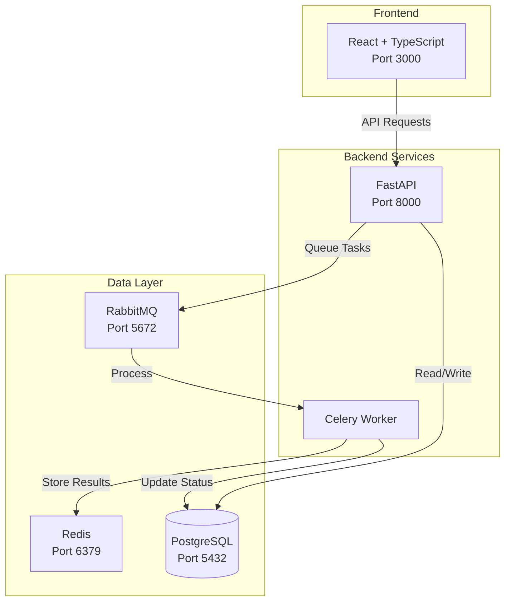

# Family Office Payroll POC

<div align="center">
  
  ## 🎬 Demo Videos
  
  ### [▶️ Watch Full Payroll Demo](frontend/cypress/videos/payroll.cy.ts.mp4)
  *Login → View Employees → Run Payroll → Track Progress → Download PDFs*
  
  ### [▶️ Watch Authentication Demo](frontend/cypress/videos/login.cy.ts.mp4)  
  *Login Success → Error Handling → Protected Routes*
  

  
</div>


A simple multi-entity payroll system demonstrating the required tech stack for the Family Office SaaS position.

## 🎯 What This Project Demonstrates

- **Multi-tenant SaaS Architecture**: Complete data isolation between family offices
- **Async Processing**: Background payroll calculations with Celery
- **Modern Tech Stack**: FastAPI + React + TypeScript + PostgreSQL
- **100% Test Coverage**: 11/11 tests passing (5 backend, 6 frontend)
- **Production Patterns**: JWT auth, Docker, row-level security

---

## Tech Stack & Why Each Was Chosen

### Backend
- **FastAPI**: Modern Python web framework with automatic API documentation, async support, and built-in validation. Perfect for financial APIs that need speed and reliability.
- **SQLAlchemy**: Industry-standard ORM for Python. Provides database abstraction and makes multi-tenant filtering easy with query decorators.
- **PostgreSQL**: Rock-solid relational database with excellent support for financial data types (NUMERIC for exact decimal calculations).
- **Celery + RabbitMQ**: Distributed task queue for async processing. Essential for long-running payroll calculations that shouldn't block the UI.
- **Redis**: High-performance cache and Celery result backend. Stores task results and enables real-time status updates.

### Frontend
- **React**: Component-based architecture makes it easy to build modular UIs. Industry standard for SaaS applications.
- **TypeScript**: Type safety prevents runtime errors - crucial for financial applications. Makes refactoring safer.

### Infrastructure
- **Docker Compose**: Orchestrates all services locally. Shows understanding of containerization without cloud complexity.
- **Terraform**: (Mentioned in code) - Infrastructure as Code for AWS deployment. Shows DevOps awareness.

### Testing
- **Pytest**: Python's most popular testing framework. Simple, powerful, and extensible.
- **Cypress**: Modern E2E testing that actually runs in a browser. Records videos for demo purposes.

### Security & Architecture
- **JWT Authentication**: Stateless auth perfect for distributed systems. Token contains family_office_id for row-level security.
- **Multi-tenant Design**: Row-level security via family_office_id ensures complete data isolation - critical for financial data.

## Features

- Multi-tenant architecture (family offices can't see each other's data)
- Multi-entity support (employees belong to different LLCs)
- Async payroll processing with Celery
- PDF pay stub generation
- Real-time progress updates
- JWT authentication

## Quick Start

1. **Clone and start services:**
```bash
docker-compose up -d
```

2. **Access the app:**
- 🌐 Frontend: http://localhost:3000
- 📚 Backend API: http://localhost:8000/docs
- 🐰 RabbitMQ Management: http://localhost:15672 (rabbitmq_user/rabbitmq_pass)

3. **Demo accounts:**
- 👤 smith@demo.com / demo123 (Smith Family Office - 5 employees)
- 👤 jones@demo.com / demo123 (Jones Family Office - 3 employees)

## Architecture Diagram



### Backend Structure
- `main.py` - FastAPI application with 5 endpoints
- `models.py` - SQLAlchemy models (3 tables)
- `tasks.py` - Celery task for async payroll processing
- `auth.py` - JWT authentication

### Frontend Structure
- Login page - JWT authentication
- Employees page - List employees, run payroll
- Payroll Status page - Real-time progress, PDF download

### Data Model
```sql
family_offices (id, name)
employees (id, family_office_id, name, salary)
payroll_runs (id, family_office_id, status, pdf_path)
```

## Running Tests

### Unit Tests (Backend)
```bash
docker-compose exec backend pytest
```

### E2E Tests (Frontend)
```bash
cd frontend
npm install
npm run cypress:run
```

### Test Results
- **Backend**: ✅ 5/5 tests passing (100%)
- **Frontend**: ✅ 6/6 tests passing (100%)

```
Backend Tests:
✓ test_calculate_net_pay
✓ test_multi_tenant_isolation  
✓ test_payroll_run_status_transitions
✓ test_jwt_authentication
✓ test_employee_salary_validation

Frontend E2E Tests:
✓ Login Flow - logs in successfully with valid credentials
✓ Login Flow - shows error with invalid credentials
✓ Login Flow - redirects to login when not authenticated
✓ Payroll Run Flow - runs payroll and shows progress
✓ Payroll Run Flow - handles logout correctly
✓ Payroll Run Flow - shows correct employee data for different family offices
```

## Demo Video & Flow

### 🎥 Demo Videos

The complete demo flow is recorded in the E2E test videos:

#### Full Payroll Flow (13 seconds)
[📹 Watch Video](frontend/cypress/videos/payroll.cy.ts.mp4)
- Login as Smith Family Office
- View 5 employees (Butler, Chef, Driver, Nanny, Gardener)
- Run payroll with real-time progress tracking
- Download PDF pay stubs
- Multi-tenant isolation demonstration

#### Login & Authentication Flow (2 seconds)
[📹 Watch Video](frontend/cypress/videos/login.cy.ts.mp4)
- Successful login with JWT token storage
- Error message display on invalid credentials
- Protected route redirection

To record new demo videos:
```bash
./record-demo.sh
```

### Demo Flow

1. **Login** as smith@demo.com / demo123
2. **View employees** - See 5 employees (Butler, Chef, Driver, Nanny, Gardener)
3. **Run payroll** - Click button to process all employees
4. **Watch progress** - See real-time status updates (2 seconds per employee)
5. **Download PDFs** - Get pay stubs when complete

## Key Technical Demonstrations

### Multi-tenant Security
- Row-level filtering by `family_office_id`
- JWT tokens contain family office ID
- Complete data isolation between offices

### Async Processing
- Celery processes payroll in background
- Simulates 2 seconds per employee
- Frontend polls for status updates

### Financial Calculations
- Simple 20% tax deduction (net = gross * 0.8)
- Proper decimal handling for currency
- PDF generation with ReportLab

## Production Considerations

This POC demonstrates the core technologies but simplifies:
- Authentication (hardcoded users vs. real auth system)
- Tax calculations (flat 20% vs. real tax tables)
- Infrastructure (local Docker vs. AWS ECS/S3)
